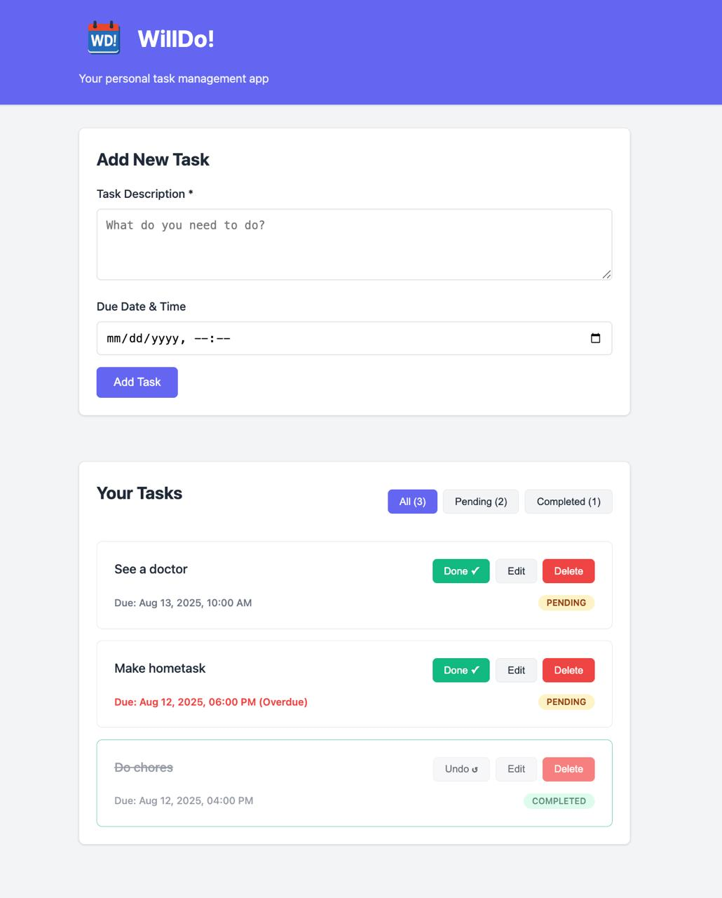

# WillDo! — веб-приложение для управления задачами

## Full-stack реализация:

* **Backend (Go)** — REST API с `gorilla/mux` (http routing), `gorm` (Go ORM для PostgreSQL).
* **Frontend (React)** — SPA с интеграцией к API.
* **PostgreSQL** — легковесный образ.
* **Nginx** — для обратного проксирования.
* **Docker** — полная контейнеризация и оркестрация.

---

## Особенности

* **Паттерны** — *middleware* для валидации JSON (`go-playground/validator`), *repository* для работы с БД.
* **Валидация** — кастомный middleware с подробными ошибками в `message` JSON-ответа.
* **Graceful Shutdown** — корректная обработка `SIGTERM`/`SIGINT` с 30-секундным таймаутом.
* **Логирование** — уровни *INFO*, *ERROR*, *DEBUG*.
* **Обработка ошибок** — единый формат JSON-ответов и кодов HTTP.
* **Docker** — alpine-образы, конфигурация через переменные окружения, наружу открыт только `nginx-proxy`.

---

```
app-backend/
├── cmd/willdo/          # точка входа в приложение
├── internal/
│   ├── config/          # конфигурационные данные
│   ├── database/        # инициализация базы данных
│   ├── handlers/        # HTTP-обработчики
│   ├── models/          # модели данных (события)
│   ├── repository/      # интерфейс доступа к данным
│   ├── server/          # настройка HTTP-сервера
│   ├── utils/           # JSON-утилиты
│   ├── validator/       # логика валидации
│   └── errors/          # кастомные ошибки
└── tests/               # юнит-тесты

app-frontend/
├── src/
│   ├── components/      # React-компоненты
│   ├── styles/          # CSS-стили
│   └── constants/       # константы frontend
└── package.json

docker/                  # конфигурация docker
nginx/                   # конфигурация nginx
```

---

## Запуск

```bash
docker-compose -f docker-compose-dev.yml up --build
```

* Frontend: [http://localhost:80](http://localhost:80)
* Backend API: [http://localhost:80/api](http://localhost:80/api)

---

## API

* `GET /api/events` — получить все события
* `GET /api/events/{id}` — получить событие по id
* `POST /api/events` — создать
* `PUT /api/events/{id}` — обновить
* `DELETE /api/events/{id}` — удалить

---

## UI

